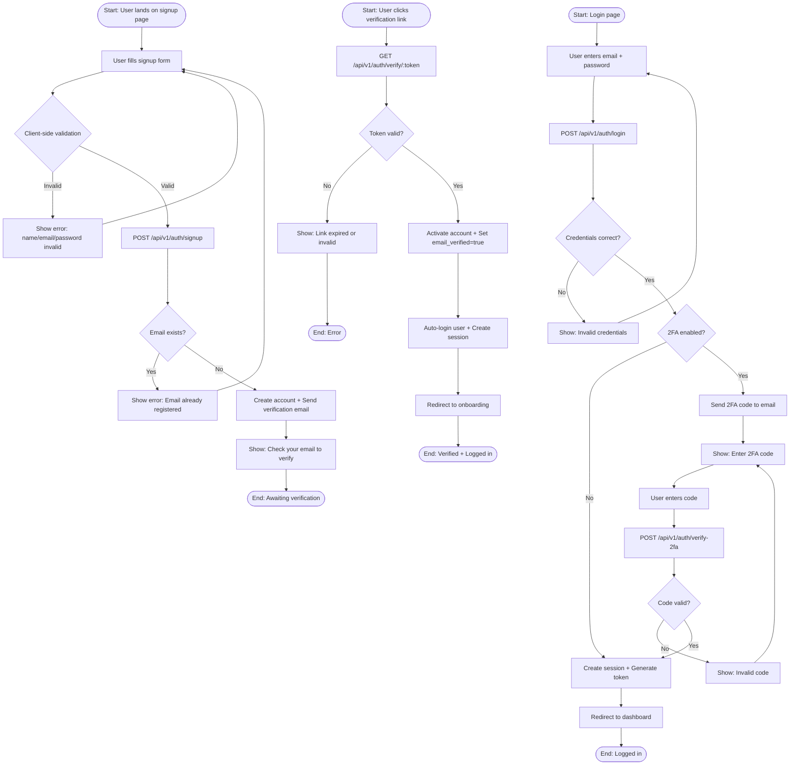
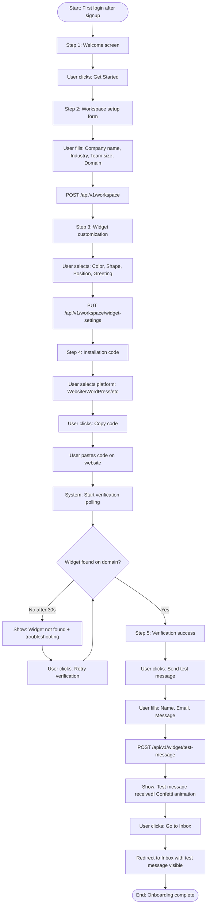
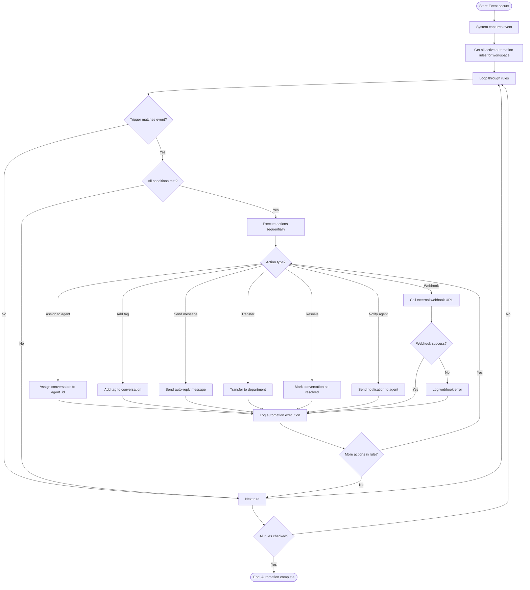
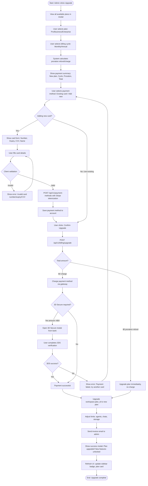
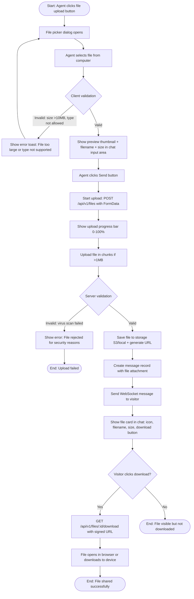

# CHATFLOW — User Flows & Flowcharts

**Purpose:** Comprehensive user flow diagrams for all major features  
**Ekran ID:** `FLOW-*`  
**Format:** Mermaid.js + ASCII + Visual specifications  

## Umumiy qoidalar (FigJam/Figma)
- **Start node:** Green capsule #10B981, "Start" text
- **Process node:** Blue rectangle #4F46E5, action text
- **Decision node:** Yellow diamond #F59E0B, question text
- **End node:** Red capsule #DC2626, "End" text
- **Connector:** Arrow 1.5px, #6B7280, label on branch (Yes/No/Error)
- **Swimlanes:** Vertical lanes for different actors (Admin/Agent/Visitor/System)
- **Legend:** Top-right corner, color meanings

---

## FLOW 1: AUTHENTICATION (SIGNUP & LOGIN)

### Description
New user registration with email verification and login with optional 2FA.

### Actors
- **Visitor** (new user), **System** (backend), **Email Service**

### Mermaid Diagram


### ASCII Flow
```
SIGNUP FLOW:
┌─────────┐
│ Start   │ User → signup page
└────┬────┘
     ▼
┌──────────────────────┐
│ Fill Form            │ Name, Email, Password
│ (Client validation)  │
└────┬─────────────────┘
     ▼
  [Valid?] ─No→ [Show error] ─┐
     │Yes                      │
     ▼                         │
┌────────────────┐            │
│ POST /signup   │◄───────────┘
└────┬───────────┘
     ▼
  [Email exists?] ─Yes→ [Email already registered] ─┐
     │No                                             │
     ▼                                               │
┌─────────────────────────┐                         │
│ Create account          │                         │
│ Send verification email │                         │
└────┬────────────────────┘                         │
     ▼                                               │
┌────────────────────────┐                          │
│ Show: Check your email │                          │
└────┬───────────────────┘                          │
     ▼                                               │
┌─────────┐                                         │
│ End     │◄────────────────────────────────────────┘
└─────────┘

LOGIN FLOW:
┌─────────┐
│ Start   │ User → login page
└────┬────┘
     ▼
┌──────────────────────┐
│ Enter email+password │
└────┬─────────────────┘
     ▼
┌────────────────┐
│ POST /login    │
└────┬───────────┘
     ▼
  [Credentials OK?] ─No→ [Invalid credentials] ─┐
     │Yes                                        │
     ▼                                           │
  [2FA enabled?] ─No→ [Create session] → [Dashboard] → [End]
     │Yes                                       │
     ▼                                          │
┌──────────────────┐                           │
│ Send 2FA code    │                           │
│ Show input field │                           │
└────┬─────────────┘                           │
     ▼                                          │
┌──────────────────┐                           │
│ User enters code │                           │
└────┬─────────────┘                           │
     ▼                                          │
  [Code valid?] ─No→ [Invalid code] ─┐         │
     │Yes                             │         │
     ▼                                │         │
[Create session] → [Dashboard] ────────────────┘
```

### Decision Points
1. **Client validation (signup):** Name 2+ chars, Email regex, Password 8+ chars with 1 uppercase + 1 number
2. **Email exists?** Check `users` table by email → If found, reject
3. **Token valid? (verification):** Check expiry (24h), check used status
4. **Credentials correct? (login):** bcrypt.compare(password, hash)
5. **2FA enabled?** Check `user.two_factor_enabled` flag
6. **2FA code valid?** Compare code + check expiry (5 min)

### Error Paths
- **Network error:** Show "Connection failed. Please try again." with retry button
- **Email service down:** Log error, show "Verification email sent" (queue for retry)
- **Token expired:** Show "Link expired. Please request new verification email." with resend button
- **Rate limiting:** After 5 failed login attempts in 15min → Show "Too many attempts. Try again in 15 minutes."

### Technical Notes
- **API Endpoints:** 
  - `POST /api/v1/auth/signup` — Create account, send verification email
  - `GET /api/v1/auth/verify/:token` — Verify email
  - `POST /api/v1/auth/login` — Login with email+password
  - `POST /api/v1/auth/verify-2fa` — Verify 2FA code
  - `POST /api/v1/auth/resend-verification` — Resend verification email
- **Session:** JWT token, 7 days expiry, stored in httpOnly cookie + localStorage as backup
- **2FA:** 6-digit code, 5min expiry, bcrypt hashed, sent via email

---

## FLOW 2: ONBOARDING

### Description
5-step onboarding after first login: Welcome → Workspace setup → Widget customization → Installation → Verification.

### Actors
- **Admin** (new user), **System**

### Mermaid Diagram


### ASCII Flow
```
ONBOARDING FLOW (5 Steps):
┌─────────────────┐
│ Step 1: Welcome │ → [Get Started] →
└─────────────────┘
┌──────────────────────────┐
│ Step 2: Workspace Setup  │
│ Fill: Company, Industry, │
│ Team size, Domain        │
│ [POST /workspace]        │
└─────┬────────────────────┘
      ▼
┌──────────────────────────┐
│ Step 3: Widget Customize │
│ Select: Color, Shape,    │
│ Position, Greeting       │
│ [PUT /widget-settings]   │
└─────┬────────────────────┘
      ▼
┌──────────────────────────┐
│ Step 4: Installation     │
│ Select platform          │
│ [Copy code] →            │
│ User pastes on site      │
└─────┬────────────────────┘
      ▼
   [Verification polling 30s]
      ▼
   [Widget found?] ─No→ [Not found + troubleshooting] ─┐
      │Yes                                              │
      ▼                                                 │
┌──────────────────────────┐                           │
│ Step 5: Verification OK  │◄──────────────────────────┘
│ [Send test message]      │
└─────┬────────────────────┘
      ▼
┌──────────────────────────┐
│ Fill test form           │
│ [POST /test-message]     │
└─────┬────────────────────┘
      ▼
┌──────────────────────────┐
│ Success! Confetti 🎉     │
│ [Go to Inbox] →          │
└─────┬────────────────────┘
      ▼
┌─────────────────┐
│ Inbox (Dashboard│
│ with test msg)  │
└─────────────────┘
      ▼
   [End]
```

### Decision Points
1. **Widget found?** Headless browser checks: `window.ChatflowWidget` + script tag in DOM, timeout 30s
2. **Test message delivered?** WebSocket receives `conversation:new` event within 2s

### Error Paths
- **Workspace creation fails:** Show "Error creating workspace. Please try again." Retry button saves form data
- **Widget verification timeout (30s):** Show troubleshooting checklist: Check code placement / Clear cache / Check console / Domain whitelist
- **Test message fails:** Show "Message send failed. Check your connection." Retry button

### Technical Notes
- **Progress:** 5 dots UI, current step highlighted Primary #4F46E5, completed steps checkmark green
- **Skip:** User can skip Step 5 (verification) with "Skip for now" link → Redirects to dashboard, widget setup incomplete badge
- **Auto-save:** Each step auto-saves on "Next" click, can resume later from localStorage `onboarding_progress`
- **API Endpoints:**
  - `POST /api/v1/workspace` — Create workspace
  - `PUT /api/v1/workspace/widget-settings` — Save widget customization
  - `POST /api/v1/workspace/widget/verify` — Start verification
  - `GET /api/v1/workspace/widget/verify/:jobId` — Poll verification status
  - `POST /api/v1/widget/test-message` — Send test message
- **WebSocket:** Listen for `widget:verified` and `conversation:new` events

---

## FLOW 3: CHAT ASSIGNMENT

### Description
When new chat arrives, the system assigns it to available agents based on assignment rules (Auto/Round-robin/Manual).

### Actors
- **Visitor** (sends message), **System** (assignment logic), **Agent** (receives chat)

### Mermaid Diagram
```mermaid
graph TD
    Start([Start: Visitor sends message from widget]) --> ReceiveMsg[System receives message via WebSocket]
    ReceiveMsg --> CreateConvo[Create new conversation record]
    CreateConvo --> CheckRule{Assignment rule?}
    
    CheckRule -->|Auto| FilterAgents[Get all agents where status=online AND available=true]
    FilterAgents --> CheckAvailable{Any agents available?}
    CheckAvailable -->|No| SetUnassigned[Set conversation status: unassigned]
    SetUnassigned --> NotifyAll[Send notification to all agents: "New unassigned chat"]
    NotifyAll --> End1([End: Unassigned])
    
    CheckAvailable -->|Yes| SelectAuto[Select agent with lowest current chat count]
    SelectAuto --> AssignAgent[Assign agent_id to conversation]
    AssignAgent --> NotifyAgent[Send WebSocket notification to assigned agent]
    NotifyAgent --> ShowInInbox[Show chat in assigned agent's Inbox]
    ShowInInbox --> AgentAccept{Agent accepts?}
    AgentAccept -->|No within 60s| ReassignFlow[Timeout → Reassign to next available]
    ReassignFlow --> SelectAuto
    AgentAccept -->|Yes| SetInProgress[Set conversation status: in_progress]
    SetInProgress --> End2([End: Assigned + In Progress])
    
    CheckRule -->|Round-robin| GetLastAssigned[Get last assigned agent_id from workspace settings]
    GetLastAssigned --> GetNextAgent[Select next agent in the list who is online]
    GetNextAgent --> CheckNextAvailable{Agent available?}
    CheckNextAvailable -->|No| GetNextAgent
    CheckNextAvailable -->|Yes| AssignAgent
    
    CheckRule -->|Manual| SetUnassigned
```

### ASCII Flow
```
CHAT ASSIGNMENT FLOW:
┌───────────────────────┐
│ Visitor sends message │ (via widget WebSocket)
└──────┬────────────────┘
       ▼
┌──────────────────────┐
│ Create conversation  │
└──────┬───────────────┘
       ▼
    [Assignment rule?]
       ├─ Auto ──────────────┐
       ├─ Round-robin ───────┤
       └─ Manual ────────────┤
                             ▼
       ┌─────────────────────────┐
       │ Auto: Get online agents │
       │ with available=true     │
       └──────┬──────────────────┘
              ▼
           [Any available?] ─No→ [Unassigned] → [Notify all agents] → [End]
              │Yes
              ▼
       ┌─────────────────────────┐
       │ Select agent with       │
       │ lowest chat count       │
       └──────┬──────────────────┘
              ▼
       ┌─────────────────────────┐
       │ Assign agent_id         │
       │ Send WebSocket notify   │
       └──────┬──────────────────┘
              ▼
       ┌─────────────────────────┐
       │ Show in agent's Inbox   │
       └──────┬──────────────────┘
              ▼
           [Agent accepts?] ─No (60s timeout)→ [Reassign] ─┐
              │Yes                                         │
              ▼                                            │
       ┌─────────────────────────┐                        │
       │ Set status: in_progress │◄───────────────────────┘
       └──────┬──────────────────┘
              ▼
           [End]
```

### Decision Points
1. **Assignment rule?** Check `workspace.assignment_rule` (auto/round-robin/manual)
2. **Any agents available?** Filter agents by `status='online'` AND `available=true` (not away/busy)
3. **Agent accepts?** Wait for 60s, if no response → timeout → reassign
4. **Agent available? (round-robin)** Check if next agent in rotation is online + available, if not → skip to next

### Error Paths
- **No agents online:** Set unassigned, show notification "No agents available. Chat waiting."
- **All agents busy:** Queue chat, show estimated wait time
- **Agent disconnects after assignment:** Auto-reassign to next available agent
- **WebSocket connection lost:** Retry sending notification 3 times with exponential backoff (1s, 2s, 4s)

### Technical Notes
- **Auto assignment:** SQL query: `SELECT agent_id FROM agents WHERE status='online' AND available=true ORDER BY current_chats ASC LIMIT 1`
- **Round-robin:** Workspace setting `last_assigned_agent_id` increments, wraps around when reaching last agent
- **Assignment timeout:** 60s timer starts when chat assigned, if agent doesn't click "Accept" → `conversation_assignment_timeout` event → reassign
- **Reassignment limit:** Max 3 reassignments, after that → mark as unassigned + manual pickup required
- **API Endpoints:**
  - `POST /api/v1/conversations` — Create conversation
  - `POST /api/v1/conversations/:id/assign` — Assign to agent (manual)
  - `POST /api/v1/conversations/:id/accept` — Agent accepts chat
- **WebSocket Events:**
  - `conversation:new` → Sent to assigned agent or all agents (unassigned)
  - `conversation:assigned` → Sent to assigned agent
  - `conversation:timeout` → Sent when assignment expires

---

## FLOW 4: AUTOMATION TRIGGER

### Description
Automation rule execution when a trigger event occurs (e.g., chat created, keyword detected, CSAT submitted).

### Actors
- **System** (trigger detector), **Automation Engine**, **Agent** (receives action result)

### Mermaid Diagram


### ASCII Flow
```
AUTOMATION TRIGGER FLOW:
┌─────────────────┐
│ Event occurs    │ (chat created, keyword, CSAT, time-based)
└────┬────────────┘
     ▼
┌──────────────────────────┐
│ Get active automation    │
│ rules for workspace      │
└────┬─────────────────────┘
     ▼
  Loop through rules ───────┐
     ▼                      │
  [Trigger matches?] ─No────┤
     │Yes                   │
     ▼                      │
  [All conditions met?] ─No─┤
     │Yes                   │
     ▼                      │
┌──────────────────────────┐│
│ Execute actions:         ││
│ ├─ Assign to agent       ││
│ ├─ Add tag               ││
│ ├─ Send auto-reply       ││
│ ├─ Transfer to dept      ││
│ ├─ Resolve               ││
│ ├─ Notify agent          ││
│ └─ Call webhook──────────┐│
└────┬─────────────────────┘│
     ▼                      ││
┌──────────────────────────┐││
│ Log execution            │││
│ (timestamp, rule_id,     │││
│  conversation_id)        │││
└────┬─────────────────────┘││
     ▼                      ││
  [More actions?] ─Yes──────┘│
     │No                     │
     ▼                       │
  [More rules?] ─Yes─────────┘
     │No
     ▼
  [End]
```

### Decision Points
1. **Trigger matches?** Compare event type + event data with rule trigger (e.g., event=`chat_created` AND source=`website`)
2. **All conditions met?** Loop through conditions, check each:
   - **Message contains keyword:** Case-insensitive regex match
   - **Chat assigned to agent:** Check `conversation.agent_id == condition.agent_id`
   - **Chat from source:** Check `conversation.source == condition.source`
   - **Time of day:** Check current time between condition start/end time
   - **CSAT score:** Check `csat_rating == condition.rating`
3. **Webhook success?** Check HTTP response status 200-299, timeout 10s

### Error Paths
- **Webhook fails:** Retry 3 times with exponential backoff (1s, 2s, 4s), log error, continue to next action
- **Assign action fails (agent offline):** Log error, send notification to admin
- **Send message action fails (chat closed):** Skip action, log warning
- **Circular dependency:** If action triggers same rule → max depth 3, then stop with error log

### Technical Notes
- **Trigger Events:** `chat_created`, `message_received`, `chat_resolved`, `csat_submitted`, `keyword_detected`, `time_based`, `chat_idle_5min`
- **Conditions:** AND logic (all must be true), support 5 types: keyword, source, agent, time, rating
- **Actions:** Execute sequentially (not parallel), each action waits for previous to complete
- **Execution Limit:** Max 5 rules triggered per event (prevent infinite loops)
- **API Endpoints:**
  - `GET /api/v1/automations` — Get all active rules
  - `POST /api/v1/automations/:id/execute` — Manual trigger
  - `GET /api/v1/automations/:id/logs` — View execution logs
- **Logging:** Store in `automation_logs` table: rule_id, conversation_id, trigger_event, conditions_met, actions_executed[], timestamp, duration_ms, errors[]

---

## FLOW 5: BILLING UPGRADE

### Description
User upgrades subscription plan with proration calculation, payment, and immediate access.

### Actors
- **Admin**, **System**, **Payment Gateway** (Stripe/Click/Payme)

### Mermaid Diagram


### ASCII Flow
```
BILLING UPGRADE FLOW:
┌─────────────────────┐
│ Admin clicks Upgrade│
└────┬────────────────┘
     ▼
┌─────────────────────┐
│ View plans modal    │
│ Select plan: Pro    │
│ Select cycle: Month │
└────┬────────────────┘
     ▼
┌──────────────────────────┐
│ System calculates        │
│ proration:               │
│ Old plan refund: $15     │
│ New plan charge: $29     │
│ Total: $14               │
└────┬─────────────────────┘
     ▼
┌──────────────────────────┐
│ Show payment summary     │
└────┬─────────────────────┘
     ▼
  [Select payment method]
     ├─ Existing card ──────┐
     └─ Add new card ───────┤
                            ▼
       ┌─────────────────────────┐
       │ Card form: Number, CVV, │
       │ Expiry, Name            │
       └──────┬──────────────────┘
              ▼
           [Valid?] ─No→ [Show error] ─┐
              │Yes                      │
              ▼                         │
       ┌─────────────────────┐         │
       │ Tokenize with Stripe│◄────────┘
       │ Save payment method │
       └──────┬──────────────┘
              ▼
       ┌─────────────────────┐
       │ [Confirm Upgrade]   │
       └──────┬──────────────┘
              ▼
       [Amount?]
              ├─ $0 (proration refund) → [Upgrade immediately] ─┐
              └─ $14 (charge) ──────────┤                       │
                                        ▼                       │
                             ┌───────────────────┐              │
                             │ Charge card       │              │
                             │ via Stripe        │              │
                             └──────┬────────────┘              │
                                    ▼                           │
                                 [3DS required?] ─No────┐       │
                                    │Yes (>$50)         │       │
                                    ▼                   │       │
                             ┌───────────────────┐      │       │
                             │ Open 3DS modal    │      │       │
                             │ User verifies     │      │       │
                             └──────┬────────────┘      │       │
                                    ▼                   │       │
                                 [3DS OK?] ─No→ [Payment failed] ─┐
                                    │Yes                │       │ │
                                    ▼                   ▼       ▼ │
                             [Payment success]◄─────────┘◄──────┘ │
                                    │                              │
                                    ▼                              │
                             ┌───────────────────┐                │
                             │ Upgrade plan_id   │◄───────────────┘
                             │ Adjust limits     │
                             │ Send invoice email│
                             └──────┬────────────┘
                                    ▼
                             ┌───────────────────┐
                             │ Show success!     │
                             │ Refresh UI        │
                             └──────┬────────────┘
                                    ▼
                                 [End]
```

### Decision Points
1. **Adding new card?** Check if user selects "Add new payment method" radio
2. **Client validation:** Card number Luhn algorithm, Expiry MM/YY future date, CVV 3-4 digits
3. **Total amount?** Proration formula: `(days_remaining / days_in_cycle) × old_plan_price + new_plan_price`
   - If result negative (downgrade mid-cycle) → $0 charge, apply refund as credit
   - If result positive → charge the difference
4. **3D Secure required?** Stripe rules: Amount >$50 OR card issuer requires 3DS
5. **3DS success?** User completes bank verification within 5 min, bank returns success status

### Error Paths
- **Card validation fails:** Show error below field (red border), "Invalid card number" etc.
- **Stripe tokenization fails:** Show "Card declined. Please try another card."
- **3DS timeout (5 min):** Show "Verification timeout. Please try again."
- **Payment failed:** Show error modal "Payment failed: [reason]. Please update your payment method."
- **Upgrade API fails:** Rollback transaction, show "Upgrade failed. Your card was not charged. Please contact support."

### Technical Notes
- **Proration Formula:**
  ```
  days_remaining = (current_billing_end_date - today) / 86400
  days_in_cycle = 30 (monthly) or 365 (annual)
  old_plan_daily_rate = old_plan_price / days_in_cycle
  refund = days_remaining × old_plan_daily_rate
  
  new_plan_price = new_plan_monthly_price OR new_plan_annual_price
  total_charge = new_plan_price - refund
  (if total_charge < 0, set to $0 and add abs(total_charge) as account credit)
  ```
- **Payment Gateways:**
  - **Stripe:** Use Stripe.js for tokenization, stripe.confirmCardPayment() for 3DS
  - **Click:** Merchant API 2.0, redirect to bank 3DS page
  - **Payme:** Merchant API, webhook for payment confirmation
- **API Endpoints:**
  - `POST /api/v1/payment-methods` — Add payment method (tokenize)
  - `POST /api/v1/billing/upgrade` — Upgrade plan with payment
  - `GET /api/v1/billing/calculate-proration` — Calculate proration amount
  - `POST /api/v1/billing/invoices` — Generate invoice after upgrade
- **WebSocket:** Emit `billing:upgraded` event to all workspace admin users to refresh UI in real-time
- **Invoice Generation:** PDF with 3 pages: Cover (plan details), Payment summary (line items), Receipt (payment method, date, transaction ID)

---

## FLOW 6: CSAT FEEDBACK

### Description
After chat resolved, customer rates experience with 1-5 star rating and optional comment.

### Actors
- **Visitor** (customer), **System**, **Agent** (receives feedback notification)

### Mermaid Diagram
```mermaid
graph TD
    Start([Start: Agent resolves chat]) --> MarkResolved[POST /api/v1/conversations/:id/resolve]
    MarkResolved --> CheckCSAT{CSAT enabled in workspace?}
    CheckCSAT -->|No| End1([End: No feedback requested])
    CheckCSAT -->|Yes| WaitDelay[Wait 2 seconds]
    WaitDelay --> ShowFeedback[Show feedback form in widget: 5 stars + comment textarea]
    ShowFeedback --> WaitResponse[Wait for visitor response or 5 min timeout]
    WaitResponse --> UserAction{Visitor action?}
    
    UserAction -->|Clicks star| SelectRating[User selects 1-5 stars]
    SelectRating --> ShowComment[Show comment textarea: "Any additional feedback?" optional 0/500]
    ShowComment --> UserComment{User adds comment?}
    UserComment -->|Yes| WriteComment[User writes comment text]
    WriteComment --> ClickSubmit[User clicks: Submit]
    UserComment -->|No| ClickSubmit
    
    UserAction -->|Clicks Skip| SkipFeedback[User clicks: Skip]
    SkipFeedback --> LogSkip[Log: CSAT skipped]
    LogSkip --> CloseWidget[Widget shows: Thank you! Auto-close after 2s]
    CloseWidget --> End2([End: Skipped])
    
    UserAction -->|Timeout 5 min| LogTimeout[Log: CSAT timeout]
    LogTimeout --> End3([End: No response])
    
    ClickSubmit --> SubmitAPI[POST /api/v1/csat]
    SubmitAPI --> SaveRating[Save to database: rating, comment, conversation_id, agent_id, timestamp]
    SaveRating --> NotifyAgent[Send WebSocket notification to agent: "New CSAT rating"]
    NotifyAgent --> ShowSuccess[Widget shows success: Red heart icon 64px + "Rahmat!" + auto-close 2s]
    ShowSuccess --> UpdateAnalytics[Update Analytics dashboard: CSAT average, response rate]
    UpdateAnalytics --> CheckTrigger{Rating <=2 (low)?}
    CheckTrigger -->|Yes| TriggerAlert[Send alert to Admin: Low CSAT rating from agent]
    CheckTrigger -->|No| End4([End: Feedback submitted])
    TriggerAlert --> End4
```

### ASCII Flow
```
CSAT FEEDBACK FLOW:
┌───────────────────────┐
│ Agent resolves chat   │
│ POST /resolve         │
└────┬──────────────────┘
     ▼
  [CSAT enabled?] ─No→ [End]
     │Yes
     ▼
  [Wait 2s]
     ▼
┌────────────────────────┐
│ Show feedback form:    │
│ ★★★★★ (5 stars)        │
│ "Any additional        │
│  feedback?" textarea   │
│ [Submit] [Skip]        │
└────┬───────────────────┘
     ▼
  Wait for response (5 min timeout) ──────┐
     ▼                                     │
  [User action?]                           │
     ├─ Clicks star ──────────┐            │
     ├─ Clicks Skip ──────────┤            │
     └─ Timeout (5 min) ──────┤            │
                              ▼            │
       ┌───────────────────────┐           │
       │ User selects rating   │           │
       │ (1-5 stars)           │           │
       └──────┬────────────────┘           │
              ▼                            │
       [User adds comment?] ─No────┐       │
              │Yes                 │       │
              ▼                    │       │
       ┌───────────────────────┐   │       │
       │ Write comment 0/500   │   │       │
       └──────┬────────────────┘   │       │
              ▼                    ▼       │
       ┌───────────────────────────┐       │
       │ [Submit]                  │       │
       │ POST /api/v1/csat         │       │
       └──────┬────────────────────┘       │
              ▼                            │
       ┌───────────────────────────┐       │
       │ Save: rating, comment,    │       │
       │ conversation_id, agent_id │       │
       └──────┬────────────────────┘       │
              ▼                            │
       ┌───────────────────────────┐       │
       │ Notify agent via WebSocket│       │
       └──────┬────────────────────┘       │
              ▼                            │
       ┌───────────────────────────┐       │
       │ Success: ❤️ "Rahmat!"     │       │
       │ Auto-close 2s             │       │
       └──────┬────────────────────┘       │
              ▼                            │
       ┌───────────────────────────┐       │
       │ Update Analytics          │       │
       └──────┬────────────────────┘       │
              ▼                            │
       [Rating <=2?] ─Yes→ [Alert Admin]   │
              │No                          │
              ▼                            ▼
           [End]◄────────────────────────[End: Skipped/Timeout]
```

### Decision Points
1. **CSAT enabled?** Check `workspace.csat_enabled` flag (Admin can disable in Settings)
2. **User action?** Listen for star click / skip click / 5 min timer expiry
3. **User adds comment?** Optional, can submit with rating only
4. **Rating <=2?** Low rating trigger: Alert admin + highlight in Analytics

### Error Paths
- **Submit API fails:** Show "Failed to submit feedback. Retrying..." retry 3 times with 2s delay
- **Network error:** Queue feedback locally, retry when connection restores (max 24h)
- **Widget closed before submit:** Save partial data (rating selected but not submitted) for analytics "Started but not completed"

### Technical Notes
- **Timing:** Show feedback form 2s after `conversation:resolved` event (not instant, give user moment to process)
- **Timeout:** 5 min countdown starts when form shown, if no interaction → log timeout + close form
- **Rating Scale:** 1-5 stars (1=Very dissatisfied, 2=Dissatisfied, 3=Neutral, 4=Satisfied, 5=Very satisfied)
- **Comment:** Optional, max 500 chars, plain text (XSS sanitized before storing)
- **API Endpoints:**
  - `POST /api/v1/csat` — Submit CSAT rating
    - Body: `{conversation_id, rating: 1-5, comment: string|null, timestamp}`
  - `GET /api/v1/csat` — Get CSAT data for analytics
- **WebSocket:** Emit `csat:new` event to agent_id when feedback submitted
- **Analytics Impact:** Real-time update of CSAT average, response rate (responses / resolved chats × 100)
- **Low Rating Alert:** If rating <=2, send email to admin + Slack notification (if integrated) + show badge in Analytics

---

## FLOW 7: FILE UPLOAD (AGENT TO VISITOR)

### Description
Agent uploads file (image, document, PDF) in chat and sends to visitor.

### Actors
- **Agent**, **System** (file storage), **Visitor** (receives file)

### Mermaid Diagram


### ASCII Flow
```
FILE UPLOAD FLOW (AGENT → VISITOR):
┌─────────────────────────┐
│ Agent clicks 📎 File    │
└────┬────────────────────┘
     ▼
┌─────────────────────────┐
│ File picker dialog      │
│ Agent selects file      │
└────┬────────────────────┘
     ▼
  [Client validation]
     ├─ Size > 10MB ──────────→ [Error: File too large] ───┐
     ├─ Type not allowed ─────→ [Error: Type not supported]─┤
     └─ Valid ─────────────────┐                            │
                               ▼                            │
       ┌───────────────────────────┐                        │
       │ Show preview in input:    │                        │
       │ [ icon ] file.pdf (2.4MB) │                        │
       │ [×] [Send]                │                        │
       └──────┬────────────────────┘                        │
              ▼                                              │
       [Agent clicks Send]                                  │
              ▼                                              │
       ┌───────────────────────────┐                        │
       │ POST /api/v1/files        │                        │
       │ Upload with progress bar  │                        │
       │ [████████████░░] 75%      │                        │
       └──────┬────────────────────┘                        │
              ▼                                              │
       [Server validation]                                  │
              ├─ Virus scan failed ──→ [Error: Security]────┤
              └─ Valid ───────────┐                         │
                                  ▼                         │
       ┌───────────────────────────┐                        │
       │ Save to S3 storage        │                        │
       │ Generate signed URL       │                        │
       └──────┬────────────────────┘                        │
              ▼                                              │
       ┌───────────────────────────┐                        │
       │ Create message with       │                        │
       │ type: file_attachment     │                        │
       └──────┬────────────────────┘                        │
              ▼                                              │
       ┌───────────────────────────┐                        │
       │ Send via WebSocket to     │                        │
       │ visitor's widget          │                        │
       └──────┬────────────────────┘                        │
              ▼                                              │
       ┌───────────────────────────┐                        │
       │ Show in chat:             │                        │
       │ ┌─────────────────────┐   │                        │
       │ │ 📄 file.pdf         │   │                        │
       │ │ 2.4 MB              │   │                        │
       │ │ [Download ↓]        │   │                        │
       │ └─────────────────────┘   │                        │
       └──────┬────────────────────┘                        │
              ▼                                              │
       [Visitor clicks Download?] ─No→ [End]                │
              │Yes                                           │
              ▼                                              │
       ┌───────────────────────────┐                        │
       │ GET /files/:id/download   │                        │
       │ with signed URL (1h exp)  │                        │
       └──────┬────────────────────┘                        │
              ▼                                              │
       [File opens/downloads]                               │
              ▼                                              │
           [End]◄────────────────────────────────────────────┘
```

### Decision Points
1. **Client validation:**
   - Size: Max 10MB (configurable in workspace settings)
   - Type: Allowed: images (jpg, png, gif, webp), documents (pdf, doc, docx, xls, xlsx), archives (zip)
   - Forbidden: Executables (.exe, .bat, .sh), scripts (.js, .php)
2. **Server validation:**
   - Virus scan: ClamAV or cloud antivirus API
   - Magic bytes check: Verify actual file type matches extension (prevent spoofing)
   - Size recheck: Confirm under limit

### Error Paths
- **File too large:** Show toast "File size exceeds 10MB limit. Please upload a smaller file."
- **Type not allowed:** Show toast "File type not supported. Allowed: images, PDF, documents."
- **Upload interrupted (network):** Show "Upload failed. Retrying..." auto-retry 3 times
- **Virus detected:** Show "File rejected for security reasons. Please scan your file."
- **Storage quota exceeded:** Show "Workspace storage limit reached. Please upgrade plan or delete old files."

### Technical Notes
- **Chunked Upload:** Files >1MB split into 512KB chunks, upload sequentially with progress tracking
- **Storage:** AWS S3 or equivalent (DigitalOcean Spaces, local storage for self-hosted)
- **Signed URLs:** Generated with 1 hour expiry for downloads, prevents direct linking
- **Image Optimization:** Images auto-resized to max 1920px width, compressed to <500KB (original preserved)
- **File Serving:** Use CDN for file delivery (CloudFront, Cloudflare)
- **API Endpoints:**
  - `POST /api/v1/files` — Upload file (multipart/form-data)
  - `GET /api/v1/files/:id/download` — Download file with signed URL
  - `DELETE /api/v1/files/:id` — Delete file (Admin/Manager only)
- **WebSocket:** Emit `message:new` event with `file_attachment` type + file metadata {id, filename, size, url, mime_type}
- **Security:** Virus scan with ClamAV, magic bytes validation, rate limit 20 uploads/hour per user

---

## FLOW 8: KNOWLEDGE BASE SEARCH

### Description
Visitor or agent searches Knowledge Base articles by keyword and views results.

### Actors
- **User** (Agent or Visitor), **System** (search engine)

### Mermaid Diagram
```mermaid
graph TD
    Start([Start: User opens Knowledge Base]) --> ShowHome[Show home page: categories list + popular articles]
    ShowHome --> UserAction{User action?}
    
    UserAction -->|Clicks category| ShowCategory[Filter articles by category]
    ShowCategory --> ShowResults
    
    UserAction -->|Enters search| TypeKeyword[User types keyword in search input]
    TypeKeyword --> Debounce[Debounce 300ms]
    Debounce --> SubmitSearch[GET /api/v1/kb/search?q=keyword]
    SubmitSearch --> ShowResults[Show results list: title, excerpt, category badge]
    
    ShowResults --> CheckResults{Results found?}
    CheckResults -->|No| ShowEmpty[Show empty state: "No articles found" + suggest creating one]
    ShowEmpty --> End1([End: No results])
    CheckResults -->|Yes| ShowList[Show articles list with relevance sorting]
    ShowList --> UserClick[User clicks article card]
    UserClick --> LoadArticle[GET /api/v1/kb/articles/:id]
    LoadArticle --> ShowArticle[Show article: title, author, date, content, attachments]
    ShowArticle --> UserRead[User reads article]
    UserRead --> ScrollBottom{User scrolls to bottom?}
    ScrollBottom -->|Yes| ShowRating[Show: "Was this helpful?" Yes/No buttons]
    ShowRating --> UserRate{User clicks?}
    UserRate -->|Yes| SubmitYes[POST /api/v1/kb/articles/:id/rate with helpful=true]
    SubmitYes --> ShowThanks[Show: "Thank you for feedback!" + fade after 2s]
    ShowThanks --> End2([End: Article rated])
    UserRate -->|No| SubmitNo[POST /api/v1/kb/articles/:id/rate with helpful=false]
    SubmitNo --> ShowForm[Show: "How can we improve?" textarea + submit]
    ShowForm --> UserComment[User writes feedback]
    UserComment --> SubmitFeedback[POST /api/v1/kb/feedback]
    SubmitFeedback --> ShowThanks
    UserRate -->|Skip| End3([End: Not rated])
    ScrollBottom -->|No| End4([End: Article viewed but not rated])
```

### ASCII Flow
```
KNOWLEDGE BASE SEARCH FLOW:
┌────────────────────────┐
│ User opens KB home     │
│ Categories + Popular   │
└────┬───────────────────┘
     ▼
  [User action?]
     ├─ Clicks category ────→ [Filter by category] ───┐
     └─ Enters search keyword ─┐                       │
                               ▼                       │
       ┌────────────────────────────┐                  │
       │ Type keyword (debounce     │                  │
       │ 300ms)                     │                  │
       │ GET /kb/search?q=keyword   │                  │
       └──────┬─────────────────────┘                  │
              ▼                                         │
       [Results found?] ─No→ [Empty state]             │
              │Yes                                      │
              ▼                                         ▼
       ┌────────────────────────────┐◄─────────────────┘
       │ Show results list:         │
       │ - Title                    │
       │ - Excerpt                  │
       │ - Category badge           │
       │ Sorted by relevance        │
       └──────┬─────────────────────┘
              ▼
       [User clicks article]
              ▼
       ┌────────────────────────────┐
       │ Load article:              │
       │ GET /kb/articles/:id       │
       │ - Title, Author, Date      │
       │ - Content (markdown)       │
       │ - Attachments              │
       └──────┬─────────────────────┘
              ▼
       [User reads...]
              ▼
       [Scrolls to bottom?] ─No→ [End]
              │Yes
              ▼
       ┌────────────────────────────┐
       │ "Was this helpful?"        │
       │ [👍 Yes] [👎 No]           │
       └──────┬─────────────────────┘
              ▼
       [User clicks?]
              ├─ Yes ──→ [POST /rate helpful=true] ──→ ["Thank you!"] → [End]
              ├─ No ───→ [POST /rate helpful=false] ─→ ["How can we improve?" textarea]
              │                                         ▼
              │                                    [User writes feedback]
              │                                         ▼
              │                                    [POST /feedback]
              │                                         ▼
              │                                    ["Thank you!"] → [End]
              └─ Skip ──────────────────────────────────────────→ [End]
```

### Decision Points
1. **User action?** Either clicks category link or types search (listen for both)
2. **Results found?** Check if API returns empty array `[]`
3. **User scrolls to bottom?** Intersection Observer triggers rating section when scrolled 90%+ of article
4. **User clicks rating?** Yes / No / Skip (close article without rating)

### Error Paths
- **Search API fails:** Show "Search unavailable. Please try again." with retry button
- **Article load fails (404):** Show "Article not found or has been deleted."
- **Rating submit fails:** Silently retry 3 times, if still fails → skip (don't block user)

### Technical Notes
- **Search Algorithm:** Full-text search on title + content, fuzzy matching with Levenshtein distance <=2
- **Relevance Sorting:** Score = title_match × 3 + content_match + view_count × 0.1
- **Debounce:** 300ms delay after user stops typing before sending search request (prevent excessive API calls)
- **Markdown Rendering:** Use marked.js or similar to render article content with syntax highlighting for code blocks
- **API Endpoints:**
  - `GET /api/v1/kb/search?q=keyword&category=optional` — Search articles
  - `GET /api/v1/kb/articles/:id` — Get article by ID
  - `POST /api/v1/kb/articles/:id/rate` — Rate article helpful/not helpful
  - `POST /api/v1/kb/feedback` — Submit improvement feedback
  - `GET /api/v1/kb/categories` — Get all categories
- **Analytics:** Track article views, search queries (for autocomplete improvement), rating distribution

---

## Umumiy Technical Requirements (Barcha Flow'lar uchun)

### API Standards
- **REST:** All endpoints follow REST conventions (GET/POST/PUT/DELETE)
- **Status Codes:** 200 OK, 201 Created, 400 Bad Request, 401 Unauthorized, 403 Forbidden, 404 Not Found, 500 Internal Server Error
- **Response Format:** JSON with structure: `{success: boolean, data: {}, error: {message, code}}`
- **Pagination:** `?page=1&limit=20`, response includes `{items[], total, page, limit, pages}`
- **Rate Limiting:** 60 requests/min per user (authenticated), 20 requests/min per IP (anonymous)

### WebSocket Events
- **Connection:** `wss://api.chatflow.uz/ws` with JWT token in query param
- **Event Format:** `{type: "event_name", data: {}, timestamp: ISO8601}`
- **Reconnection:** Exponential backoff (1s, 2s, 4s, 8s, max 30s), max 10 attempts

### Error Handling
- **Network Errors:** Auto-retry with exponential backoff for idempotent operations (GET, PUT with idempotency key)
- **Validation Errors:** Show inline errors below form fields + scroll to first error
- **Server Errors (500):** Show generic "Something went wrong" message + log error ID for support
- **Timeout:** 30s for API requests, 10s for WebSocket responses

### Performance
- **API Response Time:** Target <500ms for GET, <1s for POST/PUT
- **WebSocket Latency:** Target <100ms for message delivery
- **File Upload:** Show progress bar, support resume for large files
- **Bundle Size:** Lazy-load heavy components (charts, emoji picker, file uploader)

### Security
- **Authentication:** JWT tokens, refresh token rotation every 7 days
- **Authorization:** Check user role permissions before rendering UI + server-side validation
- **CSRF:** CSRF tokens for all mutating requests (POST/PUT/DELETE)
- **Input Sanitization:** XSS protection with DOMPurify, SQL injection prevention with parameterized queries
- **Rate Limiting:** Aggressive rate limits on sensitive endpoints (login, password reset, file upload)

---

## Figma uchun komponentlar

```
flowcharts-userflows/
├── auth-flow-signup               # Registration → Email verify → Login
├── auth-flow-login                # Login → 2FA → Dashboard
├── onboarding-flow                # 5-step onboarding → Dashboard
├── chat-assignment-flow           # Chat arrives → Assignment logic → Agent notify
├── chat-lifecycle-flow            # Open → In progress → Resolved → Archived
├── automation-trigger-flow        # Event → Condition check → Actions execute
├── billing-upgrade-flow           # View plans → Payment → Upgrade → Success
├── csat-flow                      # Chat resolved → Rating → Comment → Submit
├── file-upload-flow               # Select → Validate → Upload → Share → Download
└── kb-search-flow                 # Search → Results → Article view → Rate
```

---

## Figma AI uchun prompt

```
Design comprehensive user flow diagrams for a customer support SaaS platform with 10 major flows:

1. AUTH FLOW: Signup (form → email verify → auto-login) + Login (credentials → 2FA optional → dashboard)
   - Nodes: Start green capsule, Process blue rectangle, Decision yellow diamond, End red capsule
   - Swimlanes: Visitor, System, Email Service
   - Show error paths: Invalid inputs, expired links, wrong credentials
   - Include retry loops with max attempts

2. ONBOARDING FLOW: 5 steps (Welcome → Workspace setup → Widget customization → Installation → Verification)
   - Progress dots UI: 5 dots, current Primary #4F46E5, completed green checkmark
   - Show all decision points: Form validation, widget found/not found, test message success
   - Alternative path: Skip verification → Dashboard with incomplete badge

3. CHAT ASSIGNMENT FLOW: Event-driven (New chat → Rule check → Agent assignment)
   - 3 assignment rules branches: Auto (lowest chat count), Round-robin (rotation), Manual (unassigned pool)
   - Show timeout: 60s no accept → reassign
   - Error handling: No agents online → queue + notification

4. AUTOMATION TRIGGER FLOW: Event → Condition check → Actions execute
   - Loop through rules (max 5)
   - 7 action types branches: Assign, Add tag, Send message, Transfer, Resolve, Notify, Webhook
   - Show webhook retry logic (3 attempts exponential backoff)
   - Max depth 3 to prevent circular triggers

5. BILLING UPGRADE FLOW: Plans modal → Select plan → Proration → Payment → 3DS → Upgrade
   - Show proration calculator UI mockup
   - Payment gateway branches: Stripe (3DS modal), Click (redirect), Payme (webhook)
   - Decision: Amount $0 (refund) vs $X (charge)
   - Success animation: Confetti + plan upgraded badge

6. CSAT FLOW: Chat resolved → Wait 2s → Feedback form → Rating+Comment → Submit → Analytics update
   - Timeout 5 min → log timeout
   - Low rating (<=2) → Alert admin branch
   - Show form UI: 5 stars + textarea + Submit/Skip buttons

7. FILE UPLOAD FLOW: Select file → Validate (size/type) → Upload (chunked with progress) → Virus scan → Save S3 → Send WebSocket → Show in chat
   - Show progress bar UI 0-100%
   - Error branches: Too large, type not allowed, virus detected
   - Visitor download: Signed URL 1h expiry

8. KB SEARCH FLOW: Home → Search (debounce 300ms) → Results → Article view → Rate helpful → Feedback
   - Empty state branch: No results → Suggest create
   - Article detail: Scroll to bottom → Show rating buttons
   - Feedback loop: Not helpful → "How can we improve?" textarea

9. Visual Style:
   - Connector arrows: 1.5px #6B7280 with labels "Yes"/"No"/"Error"
   - Swimlanes: Vertical lanes with actor names (Admin/Agent/Visitor/System/Payment Gateway)
   - Decision diamonds: Yellow #F59E0B with question text + 2-3 outputs
   - Error nodes: Red #DC2626 rounded rectangle with "!" icon
   - API call nodes: Blue #4F46E5 rectangle with endpoint label "POST /api/v1/..."
   - Success nodes: Green #10B981 with checkmark icon
   - Legend: Top-right corner explaining colors and shapes


Create three flowchart frames: Admin Flow, Agent Flow, Visitor Flow.
Use color-coded nodes: green for main hub, orange for modules, blue for actions.
```
